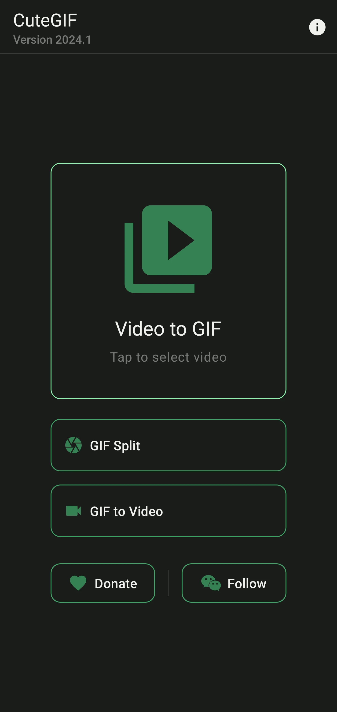
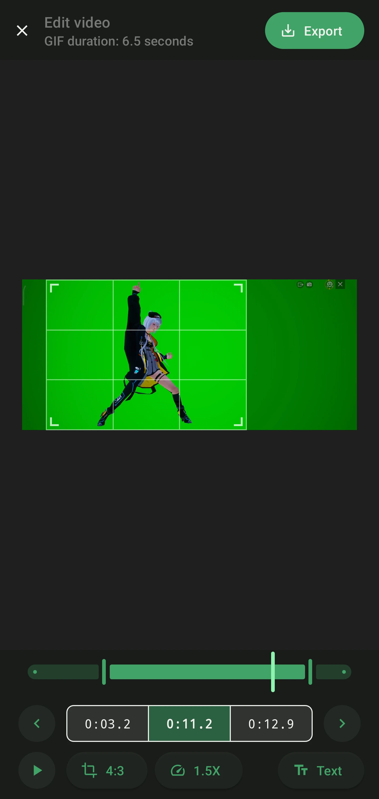
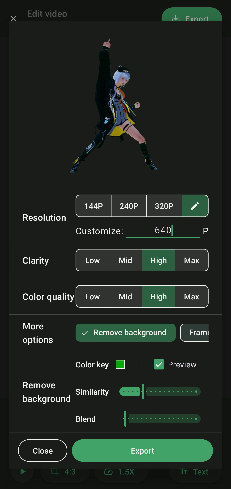
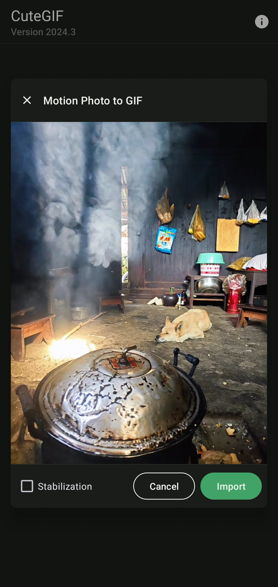
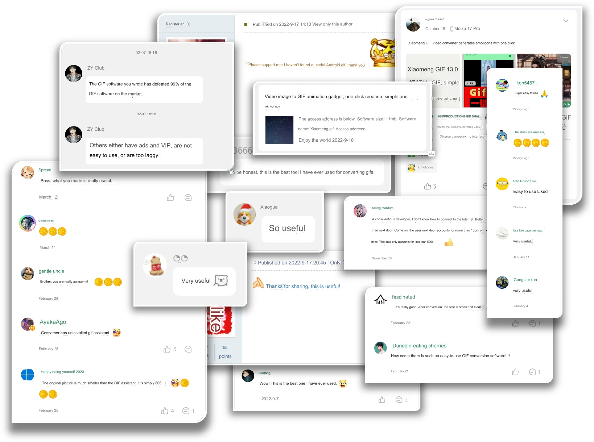

> #### English

# EasyGIF

EasyGIF is a simple and easy-to-use video to GIF tool for Android.

Latest version: `2024.3`.

---

## Features

- Video to GIF, simple and easy-to-use
- Video editing: crop, trim, speed up, add text & remove background
- Custom GIF resolution, clarity, color quality, frame rate & more
- Preview the effect before exporting
- GIF split and GIF to Video supported
- Motion Photo to GIF

---

## Screenshots

   

---

## Praise wall

(The text in this image was translated from Simplified Chinese by AI.)

---

## Copyright

沈科光 ([tasy5kg@qq.com](mailto:tasy5kg@qq.com)). 2022-2024.

This project is licensed under the [GPL-3.0 license](/COPYING).

Modified by Tuan Nguyen ([tuancoltech@gmail.com](mailto:tuancoltech@gmail.com)) on 2026
